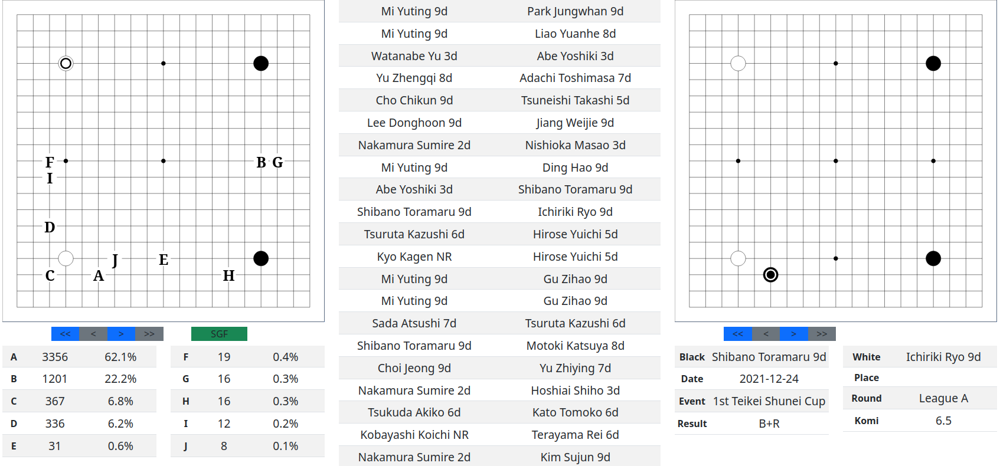

# bGo Search Engine

Go / Baduk / Weichi is an Asian board game played on a grid of 19 by 19 lines. Black and white stones are placed on the board one at a time, and each player tries to surround territory or capture stones.

I've been a Go player for 20 years and have written Go databases in a variety of languages. This is my most current version written in Python. It also has a Javascript Go board for accessing the database through a Python Flask server.

# Installing and running

Install the package.

```
pip install bgo.tgz
```


Run the shell interface:
```
[user@host ~]$ bgoshell
```

Run the flask server for the web interface:

```
[user@host ~]$ bgoserver
```

To use the web interface, edit the file __SVGSearchBoard/js/config.js__ and make sure the API url is correct for your setup.

Load the file __SVGSearchBoard/index.html__ in a browser and verify it can connect to the flask server.


---

# Web Interface



The page is divided into three columns.

* Left column is a search board with next move data
* Middle column is a list of game records that match the search board
* Right column is a game replay board

To search for games and view them: 

* Click an intersection or a row on the next move table to play a move.
* Click the SGF button to load a list of games matching the search position.
* Click a row on the list of games to load that game onto the replay board.
* Click the replay board to advance one move, or use the controls to navigate the move list.


---

# Shell Interface

The shell interface provides a command line like enviroment to import TGZ archives of game records and search the database for positions.

The text based board uses the following marks:
* __X__ is a black stone, __O__ is a white stone
* __+__ is a "star point", marks drawn on the board as visual reference points
* Lower case letters represent next moves, with "__a__" being the most popular
* The __Board Hash__ is at the bottom of the board
* The __Next Moves__ table is at the bottom, showing the game count for each next move

The following shows the shell being used to search for a position:

```
[user@host ~]$ bgoshell
Start /home/user/Projects/BGo/src/bgo  Work /home/user/Projects/BGo
Using database [/home/user/Projects/BGo/src/bgo/bgogames.sqlite] with 102164 games.
Registered Board
Registered Cd
Registered Cwd
Registered Help
Registered Import
Registered ListCommands
Registered Ls
Registered Marks
Registered Play
Registered Rotations
Registered Search
Registered Undo
Registered Year

> search
                                          
    A B C D E F G H I J K L M N O P Q R S   
 A . . . . . . . . . . . . . . . . . . . A 
 B . . . . . . . . . . . . . . . . . . . B 
 C . . . . . . . . . . . . . . . . d . . C 
 D . . . + . . . . . + . . . . . a b . . D 
 E . . . . . . . . . . . . . . h e c . . E 
 F . . . . . . . . . . . . . . . g k . . F 
 G . . . . . . . . . . . . . . i . . . . G 
 H . . . . . . . . . . . j . . . . . . . H 
 I . . . . . . . . . . . . . . . . . . . I 
 J . . . + . . . . . f l . . . . + . . . J 
 K . . . . . . . . . . . . . . . . . . . K 
 L . . . . . . . . . . . . . . . . . . . L 
 M . . . . . . . . . . . . . . . . . . . M 
 N . . . . . . . . . . . . . . . . . . . N 
 O . . . . . . . . . . . . . . . . . . . O 
 P . . . + . . . . . + . . . . . + . . . P 
 Q . . . . . . . . . . . . . . . . . . . Q 
 R . . . . . . . . . . . . . . . . . . . R 
 S . . . . . . . . . . . . . . . . . . . S 
   A B C D E F G H I J K L M N O P Q R S   
                    0                     
       a - 57346           g - 79         
       b - 41874           h - 51         
       c - 1153            i - 21         
       d - 1004            j - 13         
       e - 415             k - 12         
       f - 141             l - 6          
Total count: 102164

> play pd dp pp
                                         
   A B C D E F G H I J K L M N O P Q R S   
 A . . . . . . . . . . . . . . . . . . . A 
 B . . . . . . . . . . . . . . . . . . . B 
 C . . c b e . . . . . . . . l . . . . . C 
 D . . f a d i . . . + . . . . . X . . . D 
 E . . h g . . . . . . . . . . . . . . . E 
 F . . . . . . . . . . . . . . . . . . . F 
 G . . . . . . . . . . . . . . . . . . . G 
 H . . . . . . . . . . . . . . . . . . . H 
 I . . . . . . . . . . . . . . . . j . . I 
 J . . . + . . . . . + . . . . . k . . . J 
 K . . . . . . . . . . . . . . . . . . . K 
 L . . . . . . . . . . . . . . . . . . . L 
 M . . . . . . . . . . . . . . . . . . . M 
 N . . . . . . . . . . . . . . . . . . . N 
 O . . . . . . . . . . . . . . . . . . . O 
 P . . . O . . . . . + . . . . . X . . . P 
 Q . . . . . . . . . . . . . . . . . . . Q 
 R . . . . . . . . . . . . . . . . . . . R 
 S . . . . . . . . . . . . . . . . . . . S 
   A B C D E F G H I J K L M N O P Q R S   
                959678554                 
       a - 5405            g - 30         
       b - 2165            h - 20         
       c - 296             i - 12         
       d - 129             j - 4          
       e - 123             k - 4          
       f - 109             l - 4          
Total count: 8301

> play a
                                          
   A B C D E F G H I J K L M N O P Q R S   
 A . . . . . . . . . . . . . . . . . . . A 
 B . . . . . . . . . . . . . . . . . . . B 
 C . . . . . . . . . . . . . . . . . . . C 
 D . . . O . . . . . + . . . . . X . . . D 
 E . . . . . . . . . . . . . . . . . . . E 
 F . . . . . . . . . . . . . . . . . . . F 
 G . . . . . . . . . . . . . . . . . . . G 
 H . . . . . . . . . . . . . . . . . . . H 
 I . . . . . . . . . . . . . . . . . . . I 
 J . . f k . . . . . + . . . . . b g . . J 
 K . . i . . . . . . . . . . . . . . . . K 
 L . . . . . . . . . . . . . . . . . . . L 
 M . . . . . . . . . . . . . . . . . . . M 
 N . . d . . . . . . . . . . . . . . . . N 
 O . . . . . . . . . . . . . . . . . . . O 
 P . . . O . . j . . e . . . . . X . . . P 
 Q . . c . . a . . . . . . l h . . . . . Q 
 R . . . . . . . . . . . . . . . . . . . R 
 S . . . . . . . . . . . . . . . . . . . S 
   A B C D E F G H I J K L M N O P Q R S   
                731239216                 
       a - 3356            g - 16         
       b - 1201            h - 16         
       c - 367             i - 12         
       d - 336             j - 8          
       e - 31              k - 7          
       f - 19              l - 7          
Total count: 5376
> exit
```


---

# Database Design

The database is based around the concept of a __board hash__.

When black and white stones are placed at intersections on a Go board, they form a __posistion__.

The __position__ can be reduced to a single integer value, called a __board hash__.

A constant array of 361 integer values is defined, one value for each intersection on a 19x19 Go board. This constant array is shared between all programs that will query the database.

## Creating the constant hash table

This example shows how to create a constant table of values.

```
import numpy as np
import json

MIN_INT = np.iinfo(np.int32).min
MAX_INT = np.iinfo(np.int32).max

rng = np.random.default_rng()
hash_table = [int(i) for i in rng.integers(MIN_INT, MAX_INT, size=361)]
with open('hash_table.json', 'w') as fp:
    fp.write(json.dumps(hash_table))
```


## Generating a board hash

To make a board hash, create a hash variable initially set to zero. Iterate through every stone on the board. Look up the corresponding value in the constant board hash array. If the intersection has a black stone, add the constant hash value to the hash variable. For a white stone, subtract the constant value from the hash variable.

When finished, the hash variable will be a value that represents the position on the board.

In theory, this algorithm will not produce unique values for positions. There could be hash collisions, where more than one position creates the same board hash. 
But in practice, I scanned a very large collection of amateur game records and found no hash collisions.

This technique of using board hashes to search for positions has been used by many Go databases in the past.

This example shows how to import the constant table of values, place stones on a board, and generate a board hash.

```
import json

with open('hash_table.json', 'r') as fp:
    hash_table = json.loads(fp.read())

def calculate_hash(board):
    board_hash = 0
    for i in range(361):
        color = board[i]
        if color == 'X': # black stone
            board_hash += hash_table[i]
        elif color == 'O': # white stone
            board_hash -= hash_table[i]
    return board_hash

board = [0 for i in range(361)] # Create a blank board
print(calculate_hash(board))
board[4 * 19 + 4] = 'X' # Add a black stone at 4,4
print(calculate_hash(board))
board[15 * 19 + 15] = 'O' # Add a white stone at 15,15
print(calculate_hash(board))
board[15 * 19 + 15] = 0 # Remove the white stone
print(calculate_hash(board))
```

The output of the above block is:

```
0
-1711811520
-2957804749
-1711811520
```

# Board Transformations

## Coordinates

Coordinates are stored as either a two character Alpha coordinate, or a two integer Cartesian coordinate.

```
>>> import bgo.coordinate as Coord
>>> alpha = Corod.Alpha('pd')
>>> alpha
Alpha(x='p', y='d')
>>> cart = alpha.to_cart()
>>> cart
Cart(x=15, y=3)
>>> cart.to_alpha()
Alpha(x='p', y='d')

```

## Transformations

A position on a board can be rotated and flipped into 8 different transformed boards.

The transforms are numbered 0 to 7. Transform 0 is the identity transform and returns the input position.


```
TRANSFORM_MATRIX = (     # N  Inv  Operation
    ((1, 0), (0, 1)),    # 0   0    Identity                (x,y)       (X, Y)
    ((-1, 0), (0, 1)),   # 1   1    Flip left-right         (18-x, y)   (-X, Y)
    ((1, 0), (0, -1)),   # 2   2    Flip top-bottom         (x, 18-y)   (X, -Y)
    ((0, 1), (-1, 0)),   # 3   5    Rotate 90 CCW           (y, 18-x)   (Y, -X)
    ((-1, 0), (0, -1)),  # 4   4    Rotate 180 CCW          (18-x,18-y) (-X, -Y)
    ((0, -1), (1, 0)),   # 5   3    Rotate 270 CCW          (18-y, x)   (-Y, X)
    ((0, 1), (1, 0)),    # 6   6    Rotate 90 CCW, FlipLR   (y, x)      (Y, X)
    ((0, -1), (-1, 0)),  # 7   7    Rotate 270 CCW, FlipTB  (18-y,18-x) (-Y, -X)
```
Each transform has a tuple of tuples describing the operations done to the X and Y coordinates.


The format of these tuples is __((operation for x coordinate), (operation for y coordinate))__

The operation format is __(multiply x by, multiply y by)__

The identity transform #0 shows __((1, 0), (0, 1))__. 

The first tuple __(1, 0)__ says to multiply the x coordinate by 1 and the y coordinate by 0, yielding the x coordinate. 

The second tuple __(0, 1)__ says to multiple the x coordinate by 0, and the coordinate by 1, yielding the y coordinate.

If the input coordinate is (x, y) then the output would be (x, y), the same as the input.

For transform #1, flip left to right, the operations are __((-1, 0), (0, 1))__. This inverts the x coordinate and keeps the y coordinate the same.


## Working with all transforms

When Go games are recorded to SGF records, the position could be in any orientation. Two observers recording the same game could produce SGF files in different oritentations.

Because of this when importing or searching for games the database must consider positions in all transforms. The database should also transform positions to a common transform so that game records all appear in the same transform. Search results must be accurate no matter what orientation the search position is entered in.

To search for a position, the database performs the following steps:

1. Convert the input position (identity) to all other transforms.
2. Calculate the board hash for all 8 transformed positions.
3. Search the database for games containing any of the 8 transformed positions.
4. The resulting data will be a list of games that match the input position in any transform.

When searching for next moves, extra steps must be performed to transform and merge the moves.
1. Convert the input position to all transforms.
2. Calculate the hash for all 8 positions.
3. Search the database for next moves in all 8 positions.
4. For transforms 1-7, transform the next moves to transform 0 (identity), and add them to the moves in transform 0.
5. The combined moves in transform 0 may have moves that are identical due to board symmetries. Combine moves that are identical.

## Next Move Example

The next block shows the results of a search in all 8 transforms. 

__X__ is a black stone and __O__ is a white stone.

Lower case letters are next moves. In this position, black is next to move, so the letters show possible moves for the next __X__ (black) stone. __A__ is the most popular next move, __B__ is the second most popular, and so on.

The number at the bottom of the board is the board hash.

The order of the most popular next moves may change slightly between transforms, but this should be ignored and considered random. All that matters is the merged/combined counts.

```
                0: identity                             1: flip left-right            
   A B C D E F G H I J K L M N O P Q R S       A B C D E F G H I J K L M N O P Q R S    
 A . . . . . . . . . . . . . . . . . . . A   A . . . . . . . . . . . . . . . . . . . A  
 B . . . . . . . . . . . . . . . . . . . B   B . . . . . . . . . . . . . . . . . . . B  
 C . . . . . . . . . . . . . . . . . . . C   C . . . . . . . . . . . . . . . . . . . C  
 D . . . O . . . . . + . . . . . X . . . D   D . . . X . . . . . + . . . . . O . . . D  
 E . . . . . . . . . . . . . . . . . . . E   E . . . . . . . . . . . . . . . . . . . E  
 F . . . . . . . . . . . . . . . . . . . F   F . . . . . . . . . . . . . . . . . . . F  
 G . . . . . . . . . . . . . . . . . . . G   G . . . . . . . . . . . . . . . . . . . G  
 H . . . . . . . . . . . . . . . . . . . H   H . . . . . . . . . . . . . . . . . . . H  
 I . . . . . . . . . . . . . . . . . . . I   I . . . . . . . . . . . . . . . . . . . I  
 J . . f + . . . . . + . . . . . b . . . J   J . . . b . . . . . + . . . . . + f . . J  
 K . . . . . . . . . . . . . . . . . . . K   K . . . . . . . . . . . . . . . . . . . K  
 L . . . . . . . . . . . . . . . . . . . L   L . . . . . . . . . . . . . . . . . . . L  
 M . . . . . . . . . . . . . . . . . . . M   M . . . . . . . . . . . . . . . . . . . M  
 N . . d . . . . . . . . . . . . . . . . N   N . . . . . . . . . . . . . . . . d . . N  
 O . . . . . . . . . . . . . . . . . . . O   O . . . . . . . . . . . . . . . . . . . O  
 P . . . O . . . . . e . . . . . X . . . P   P . . . X . . . . . e . . . . . O . . . P  
 Q . . c . . a . . . . . . . . . . . . . Q   Q . . . . . . . . . . . . . a . . c . . Q  
 R . . . . . . . . . . . . . . . . . . . R   R . . . . . . . . . . . . . . . . . . . R  
 S . . . . . . . . . . . . . . . . . . . S   S . . . . . . . . . . . . . . . . . . . S  
   A B C D E F G H I J K L M N O P Q R S       A B C D E F G H I J K L M N O P Q R S    
                731239216                                  -731239216                 

             2: flip top-bottom                          3: rotate 90 ccw             
   A B C D E F G H I J K L M N O P Q R S       A B C D E F G H I J K L M N O P Q R S    
 A . . . . . . . . . . . . . . . . . . . A   A . . . . . . . . . . . . . . . . . . . A  
 B . . . . . . . . . . . . . . . . . . . B   B . . . . . . . . . . . . . . . . . . . B  
 C . . c . . a . . . . . . . . . . . . . C   C . . . . . . . . . . . . . . . . . . . C  
 D . . . O . . . . . e . . . . . X . . . D   D . . . X . . . . . b . . . . . X . . . D  
 E . . . . . . . . . . . . . . . . . . . E   E . . . . . . . . . . . . . . . . . . . E  
 F . . d . . . . . . . . . . . . . . . . F   F . . . . . . . . . . . . . . . . . . . F  
 G . . . . . . . . . . . . . . . . . . . G   G . . . . . . . . . . . . . . . . . . . G  
 H . . . . . . . . . . . . . . . . . . . H   H . . . . . . . . . . . . . . . . . . . H  
 I . . . . . . . . . . . . . . . . . . . I   I . . . . . . . . . . . . . . . . . . . I  
 J . . f + . . . . . + . . . . . b . . . J   J . . . + . . . . . + . . . . . e . . . J  
 K . . . . . . . . . . . . . . . . . . . K   K . . . . . . . . . . . . . . . . . . . K  
 L . . . . . . . . . . . . . . . . . . . L   L . . . . . . . . . . . . . . . . . . . L  
 M . . . . . . . . . . . . . . . . . . . M   M . . . . . . . . . . . . . . . . . . . M  
 N . . . . . . . . . . . . . . . . . . . N   N . . . . . . . . . . . . . . . . a . . N  
 O . . . . . . . . . . . . . . . . . . . O   O . . . . . . . . . . . . . . . . . . . O  
 P . . . O . . . . . + . . . . . X . . . P   P . . . O . . . . . + . . . . . O . . . P  
 Q . . . . . . . . . . . . . . . . . . . Q   Q . . . . . . . . . f . . . d . . c . . Q  
 R . . . . . . . . . . . . . . . . . . . R   R . . . . . . . . . . . . . . . . . . . R  
 S . . . . . . . . . . . . . . . . . . . S   S . . . . . . . . . . . . . . . . . . . S  
   A B C D E F G H I J K L M N O P Q R S       A B C D E F G H I J K L M N O P Q R S    
                731239216                                  -870213878                 

             4: rotate 180 ccw                          5: rotate 270 ccw             
   A B C D E F G H I J K L M N O P Q R S       A B C D E F G H I J K L M N O P Q R S    
 A . . . . . . . . . . . . . . . . . . . A   A . . . . . . . . . . . . . . . . . . . A  
 B . . . . . . . . . . . . . . . . . . . B   B . . . . . . . . . . . . . . . . . . . B  
 C . . . . . . . . . . . . . a . . c . . C   C . . c . . d . . . f . . . . . . . . . C  
 D . . . X . . . . . e . . . . . O . . . D   D . . . O . . . . . + . . . . . O . . . D  
 E . . . . . . . . . . . . . . . . . . . E   E . . . . . . . . . . . . . . . . . . . E  
 F . . . . . . . . . . . . . . . . d . . F   F . . a . . . . . . . . . . . . . . . . F  
 G . . . . . . . . . . . . . . . . . . . G   G . . . . . . . . . . . . . . . . . . . G  
 H . . . . . . . . . . . . . . . . . . . H   H . . . . . . . . . . . . . . . . . . . H  
 I . . . . . . . . . . . . . . . . . . . I   I . . . . . . . . . . . . . . . . . . . I  
 J . . . b . . . . . + . . . . . + f . . J   J . . . e . . . . . + . . . . . + . . . J  
 K . . . . . . . . . . . . . . . . . . . K   K . . . . . . . . . . . . . . . . . . . K  
 L . . . . . . . . . . . . . . . . . . . L   L . . . . . . . . . . . . . . . . . . . L  
 M . . . . . . . . . . . . . . . . . . . M   M . . . . . . . . . . . . . . . . . . . M  
 N . . . . . . . . . . . . . . . . . . . N   N . . . . . . . . . . . . . . . . . . . N  
 O . . . . . . . . . . . . . . . . . . . O   O . . . . . . . . . . . . . . . . . . . O  
 P . . . X . . . . . + . . . . . O . . . P   P . . . X . . . . . b . . . . . X . . . P  
 Q . . . . . . . . . . . . . . . . . . . Q   Q . . . . . . . . . . . . . . . . . . . Q  
 R . . . . . . . . . . . . . . . . . . . R   R . . . . . . . . . . . . . . . . . . . R  
 S . . . . . . . . . . . . . . . . . . . S   S . . . . . . . . . . . . . . . . . . . S  
   A B C D E F G H I J K L M N O P Q R S       A B C D E F G H I J K L M N O P Q R S    
                -731239216                                 870213878                  

     6: rotate 90 ccw, flip top-bottom          7: rotate 270 ccw, flip top-bottom    
   A B C D E F G H I J K L M N O P Q R S       A B C D E F G H I J K L M N O P Q R S    
 A . . . . . . . . . . . . . . . . . . . A   A . . . . . . . . . . . . . . . . . . . A  
 B . . . . . . . . . . . . . . . . . . . B   B . . . . . . . . . . . . . . . . . . . B  
 C . . . . . . . . . f . . . d . . c . . C   C . . . . . . . . . . . . . . . . . . . C  
 D . . . O . . . . . + . . . . . O . . . D   D . . . X . . . . . b . . . . . X . . . D  
 E . . . . . . . . . . . . . . . . . . . E   E . . . . . . . . . . . . . . . . . . . E  
 F . . . . . . . . . . . . . . . . a . . F   F . . . . . . . . . . . . . . . . . . . F  
 G . . . . . . . . . . . . . . . . . . . G   G . . . . . . . . . . . . . . . . . . . G  
 H . . . . . . . . . . . . . . . . . . . H   H . . . . . . . . . . . . . . . . . . . H  
 I . . . . . . . . . . . . . . . . . . . I   I . . . . . . . . . . . . . . . . . . . I  
 J . . . + . . . . . + . . . . . e . . . J   J . . . e . . . . . + . . . . . + . . . J  
 K . . . . . . . . . . . . . . . . . . . K   K . . . . . . . . . . . . . . . . . . . K  
 L . . . . . . . . . . . . . . . . . . . L   L . . . . . . . . . . . . . . . . . . . L  
 M . . . . . . . . . . . . . . . . . . . M   M . . . . . . . . . . . . . . . . . . . M  
 N . . . . . . . . . . . . . . . . . . . N   N . . a . . . . . . . . . . . . . . . . N  
 O . . . . . . . . . . . . . . . . . . . O   O . . . . . . . . . . . . . . . . . . . O  
 P . . . X . . . . . b . . . . . X . . . P   P . . . O . . . . . + . . . . . O . . . P  
 Q . . . . . . . . . . . . . . . . . . . Q   Q . . c . . d . . . f . . . . . . . . . Q  
 R . . . . . . . . . . . . . . . . . . . R   R . . . . . . . . . . . . . . . . . . . R  
 S . . . . . . . . . . . . . . . . . . . S   S . . . . . . . . . . . . . . . . . . . S  
   A B C D E F G H I J K L M N O P Q R S       A B C D E F G H I J K L M N O P Q R S    
                870213878                                  -870213878                 
```

When all of these boards are transformed to identity and combined, the result is:

```
   A B C D E F G H I J K L M N O P Q R S   
 A . . . . . . . . . . . . . . . . . . . A 
 B . . . . . . . . . . . . . . . . . . . B 
 C . . . . . . . . . . . . . . . . . . . C 
 D . . . O . . . . . + . . . . . X . . . D 
 E . . . . . . . . . . . . . . . . . . . E 
 F . . . . . . . . . . . . . . . . . . . F 
 G . . . . . . . . . . . . . . . . . . . G 
 H . . . . . . . . . . . . . . . . . . . H 
 I . . . . . . . . . . . . . . . . . . . I 
 J . . f + . . . . . + . . . . . b . . . J 
 K . . . . . . . . . . . . . . . . . . . K 
 L . . . . . . . . . . . . . . . . . . . L 
 M . . . . . . . . . . . . . . . . . . . M 
 N . . d . . . . . . . . . . . . . . . . N 
 O . . . . . . . . . . . . . . . . . . . O 
 P . . . O . . . . . e . . . . . X . . . P 
 Q . . c . . a . . . . . . . . . . . . . Q 
 R . . . . . . . . . . . . . . . . . . . R 
 S . . . . . . . . . . . . . . . . . . . S 
   A B C D E F G H I J K L M N O P Q R S   
                731239216                 
       a - 3356            d - 336        
       b - 1201            e - 31         
       c - 367             f - 19    
```

This example also includes the exact counts for each next move.

If a black stone is played at next move position __A__ (coordinate 'FQ'), the result will show the next moves for the new position.

```
> play a
                                          
   A B C D E F G H I J K L M N O P Q R S   
 A . . . . . . . . . . . . . . . . . . . A 
 B . . . . . . . . . . . . . . . . . . . B 
 C . . . . . . . . . . . . . e . . f . . C 
 D . . . O . . . . . + . . . . . X . . . D 
 E . . . . . . . . . . . . . . . . . . . E 
 F . . . . . . . . . . . . . . . . . . . F 
 G . . . . . . . . . . . . . . . . . . . G 
 H . . . . . . . . . . . . . . . . . . . H 
 I . . . . . . . . . . . . . . . . . . . I 
 J . . . + . . . . . + . . . . . + . . . J 
 K . . . . . . . . . . . . . . . . . . . K 
 L . . . . . . . . . . . . . . . . . . . L 
 M . . . . . . . . . . . . . . . . . . . M 
 N . . a c . . . . . . . . . . . . . . . N 
 O . . . . . . . . . . . . . . . . . . . O 
 P . . . O . . . . d + . . . . . X . . . P 
 Q . . . . . X . b . . . . . . . . . . . Q 
 R . . . . . . . . . . . . . . . . . . . R 
 S . . . . . . . . . . . . . . . . . . . S 
   A B C D E F G H I J K L M N O P Q R S   
                473219409                 
       a - 1896            d - 214        
       b - 475             e - 169        
       c - 357             f - 65                          
```


# License

This program is free software: you can redistribute it and/or modify it under the terms of the GNU General Public License as published by the Free Software Foundation, either version 3 of the License, or (at your option) any later version.

This program is distributed in the hope that it will be useful, but WITHOUT ANY WARRANTY; without even the implied warranty of MERCHANTABILITY or FITNESS FOR A PARTICULAR PURPOSE. See the GNU General Public License for more details.

You should have received a copy of the GNU General Public License along with this program. If not, see https://www.gnu.org/licenses/.


# Source

https://github.com/brianb72
